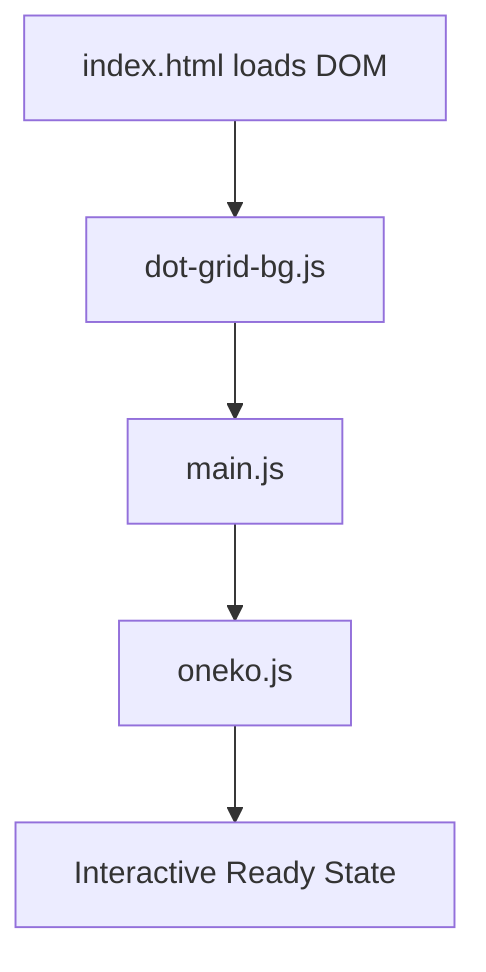
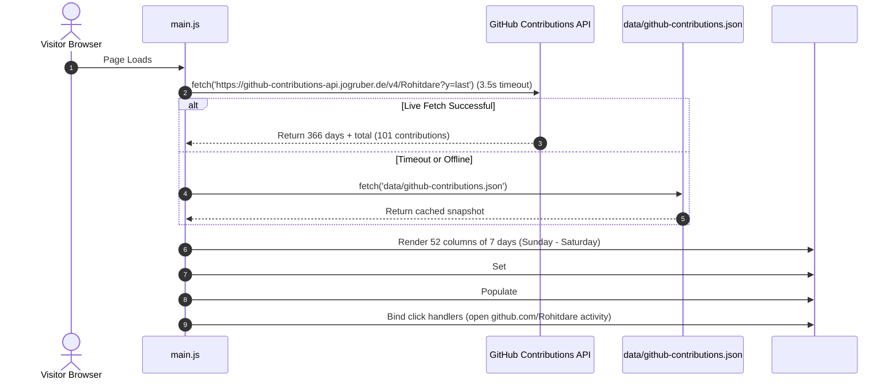
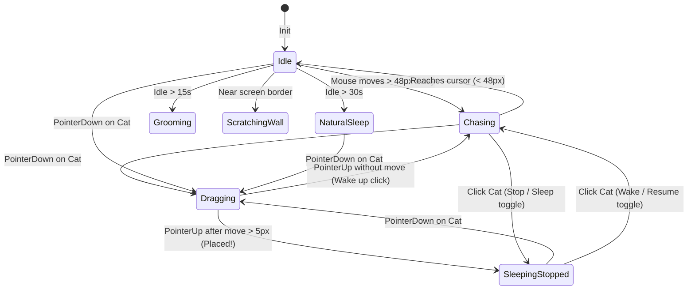

# System Architecture & Function Flow Map

This document details the architectural layout, script execution sequence, event lifecycle, and complete function-to-DOM mappings for the **Trainer ID Developer Portfolio** (`Rohitdare/portfolio`).

---

## 1. High-Level Architecture & Layering

The application is structured into 6 strict z-index layers to prevent rendering conflicts and maintain the suspended 3D badge metaphor:

```
┌─────────────────────────────────────────────────────────────┐  Z-INDEX
│ Level 5: Oneko Companion (#oneko), Toasts, Popups           │  2147483647
├─────────────────────────────────────────────────────────────┤
│ Level 4: Fixed App Header & Navigation Bar (.app-header)   │  100
├─────────────────────────────────────────────────────────────┤
│ Level 3: Suspended Trainer Card Badge (#card-3d-wrapper)    │  20
├─────────────────────────────────────────────────────────────┤
│ Level 2: Physical Lanyard Strap & Clasp (#lanyard-assembly) │  10
├─────────────────────────────────────────────────────────────┤
│ Level 1: Background GIF Artwork Layer (.gif-artwork-layer)  │  5
├─────────────────────────────────────────────────────────────┤
│ Level 0: Interactive Canvas Dot Grid (#dot-grid-canvas)     │  0
└─────────────────────────────────────────────────────────────┘
```

---

## 2. File Inventory & Execution Order

When a user visits `index.html`, the browser executes scripts in the following order:



| File | Type | Primary Responsibility |
| :--- | :--- | :--- |
| `index.html` | HTML5 | Semantic structure: HUD header, lanyard clasp, 3D card with 6 sections, toast alert |
| `index.css` | CSS3 | Design tokens, color themes, 3D transform preserve, glassmorphism, responsive styles |
| `dot-grid-bg.js` | JavaScript | Background dot-matrix canvas with cursor-repulsion & mouse trail physics |
| `main.js` | JavaScript | 3D card tilt physics, hash routing, live GitHub heatmap loader, audio synthesizer, IST clock |
| `oneko.js` | JavaScript | Interactive desktop cat, drag-and-drop placement, click-to-pause/sleep, custom SFX |
| `data/github-contributions.json` | JSON Data | Cached 366-day real contribution dataset for instant offline rendering |
| `assets/` | Media Assets | `avatar.png`, `katana.gif`, `katana-manga.png`, `naruto.gif`, `oneko.gif` |

---

## 3. Function & Module Mapping

### A. `main.js` (Core Application Controller)

| Function Name | Defined At | Trigger / Listener | Target Element(s) | Action / Description |
| :--- | :--- | :--- | :--- | :--- |
| `initTheme()` | `main.js:410` | `DOMContentLoaded` | `document.documentElement`, `#theme-icon` | Reads `localStorage('trainer_id_theme')`, toggles `.light` class, and sets icon (`light_mode` vs `dark_mode`). |
| `playBeep(freq, dur, type)` | `main.js:52` | UI interactions (clicks, tab switches) | Web Audio `AudioContext` | Generates a synthesized retro handheld chime / feedback beep with exponential decay. |
| `onPointerMove(e)` | `main.js:81` | `window.mousemove`, `touchmove` | `#trainer-card`, `#card-3d-wrapper`, `.card-specular-sheen`, `#lanyard-assembly` | Computes normalized mouse offset from card center, applies dynamic 3D rotation (`rotateX`, `rotateY`), moves specular highlight, and slightly tilts lanyard. |
| `onPointerLeave()` | `main.js:129` | `document.mouseleave` | `#trainer-card`, `#card-3d-wrapper`, `#lanyard-assembly` | Gently springs the 3D card and lanyard back to neutral resting position. |
| `navigateToSection(targetId, playSound)` | `main.js:158` | Hash change, nav click, or deep link | `.card-section`, `.nav-link`, `#telemetry-index`, `#telemetry-bar` | Hides inactive sections, activates target section with CSS slide/fade, updates active pill styling, recalculates telemetry HUD percentage, and smooth scrolls to top if page was scrolled down. |
| `updateISTClock()` | `main.js:275` | `setInterval(..., 1000)` | `#ist-clock` | Calculates live Indian Standard Time (UTC+5:30) in 24-hr format (`HH:MM:SS IST`). |
| `loadRealGitHubContributions()` | `main.js:338` | `DOMContentLoaded` | `#heatmap-grid`, `#heatmap-total-count`, `#heatmap-months-row` | Fetches live contributions from GitHub API with 3.5s timeout; falls back to `data/github-contributions.json`. Builds 52 week columns, binds click links to day activity. |
| `renderFallbackMatrix()` | `main.js:390` | Network fallback | `#heatmap-grid` | Renders a clean 52x7 placeholder grid if neither live API nor local JSON is available. |
| `showToast(msg)` | `main.js:443` | Contact form submit / actions | `#toast-notice`, `.toast-text` | Slides in terminal toast notification with sound, auto-dismisses after 3 seconds. |
| `battleObserver` & Scroll Handler | `main.js:262` | Viewport scroll intersection & `window.scroll` | `#final-battle`, `body`, `.gif-artwork-layer`, `.telemetry-hud` | Monitors scroll to bottom; triggers `.in-view` entrance for battle sprite & CTAs; toggles `body.battle-mode` and `body.scrolled-past-hero` to fade out katana artwork and telemetry HUD for full-screen isolation. |
| `battleContactBtn` Listener | `main.js:282` | Click on "Contact Me" CTA | `#battle-contact-btn` | Plays confirmation chime, smooth scrolls window to top, and activates `#section-contact`. |

---

### B. `oneko.js` (Interactive Desktop Cat)

| Function Name | Defined At | Trigger / Listener | Target Element(s) | Action / Description |
| :--- | :--- | :--- | :--- | :--- |
| `init()` | `oneko.js:182` | `DOMContentLoaded` | `document.body`, `#oneko` | Creates `#oneko` element, loads sprite image (with embedded base64 fallback), restores saved position, and binds mouse/touch listeners. |
| `playSfx(type)` | `oneko.js:106` | Oneko interactions | Web Audio `AudioContext` | Plays synthesized cat sounds: `pickup` (rising chirp), `drop`/`sleep` (purr tone), `wake` (alert chime). |
| `showBalloon(text)` | `oneko.js:149` | State changes (`sleep`, `placed`, `wake`) | `.oneko-balloon` | Creates an animated retro floating text bubble over Oneko (`Zzz...`, `Meow!`) that fades after 1.8s. |
| `onPointerDown(e)` | `oneko.js:264` | `nekoEl.mousedown`, `touchstart` | `#oneko` | Initiates dragging, records offsets, sets cursor to `grabbing`, plays pickup sound, wiggles paws. |
| `onPointerMove(e)` | `oneko.js:287` | `window.mousemove`, `touchmove` | `#oneko`, `.oneko-balloon` | If dragging: moves cat to pointer coordinates, checks drag threshold (`>5px`), cycles dangling paw frames. Updates target mouse position for chasing. |
| `onPointerUp()` | `oneko.js:324` | `window.mouseup`, `touchend` | `#oneko` | If dragged: places cat at spot, sets `isStopped = true`, triggers sleep. If clicked without dragging: toggles `toggleStop()`. |
| `toggleStop()` | `oneko.js:342` | Cat click, or <kbd>Enter</kbd>/<kbd>Space</kbd> | `#oneko` | Toggles between sleeping in place (`isStopped = true`) and active following (`isStopped = false`). |
| `frame()` | `oneko.js:413` | `requestAnimationFrame` loop | `#oneko` | Main physics loop. If stopped: renders sleeping frame. If moving: calculates vector towards mouse, chooses 8-direction sprite, updates coordinates. |
| `idle()` | `oneko.js:371` | Distance to cursor < 48px | `#oneko` | Cycles idle behaviors: grooming, washing, sleeping, wall-scratching. |
| `setSprite(name, frame)` | `oneko.js:361` | Animation updates | `#oneko` | Calculates 32px background offsets on the sprite sheet. |

---

### C. `dot-grid-bg.js` (Canvas Background Controller)

| Function Name | Defined At | Trigger / Listener | Target Element(s) | Action / Description |
| :--- | :--- | :--- | :--- | :--- |
| `initCanvas()` | `dot-grid-bg.js:28` | Window load & resize | `#dot-grid-canvas` | Scales canvas to `window.innerWidth` & `innerHeight` accounting for device pixel ratio (`window.devicePixelRatio`). |
| `createGrid()` | `dot-grid-bg.js:52` | Window resize | Memory dot array | Populates a 2D matrix of dot points spaced 32px apart across the viewport. |
| `draw()` | `dot-grid-bg.js:90` | `requestAnimationFrame` | Canvas 2D context | Computes cursor gravity distance; displaces dots away from mouse pointer with elastic return spring physics. |

---

## 4. Section & Navigation Routing Flow

```mermaid
flowchart TD
    NavClick[User Clicks Nav Link / CTA] --> HashChange[URL Hash Changes: #projects]
    HashChange --> SwitchSection[switchSection('projects', true)]
    SwitchSection --> PlayBeep[playBeep(620Hz, 0.06s)]
    SwitchSection --> HideActive[Remove .active from current section]
    SwitchSection --> ShowTarget[Add .active to target section with slide-in animation]
    SwitchSection --> UpdateHUD[Update Telemetry: Index 03/06, Bar Width 50%]
    SwitchSection --> UpdateNavPill[Move active pill background to clicked link]
```

Supported Routes:
1. `#home` — Hero card, portrait, bio, quote with `戦え` watermark, live GitHub matrix, quicklinks.
2. `#stack` — Battle Stack (Frontend, Backend, DevOps, Tools categorized badge chips).
3. `#projects` — Featured engineering case studies (Task Tracker, Softtech, Shikai).
4. `#experience` — Career timeline (Senior Developer, Frontend Engineer, Open Source).
5. `#blogs` — Technical publications and architecture articles.
6. `#contact` — Interactive transmission terminal & communication channels.

---

## 5. Live GitHub Contribution Flow



---

## 6. Oneko Desktop Companion State Machine


